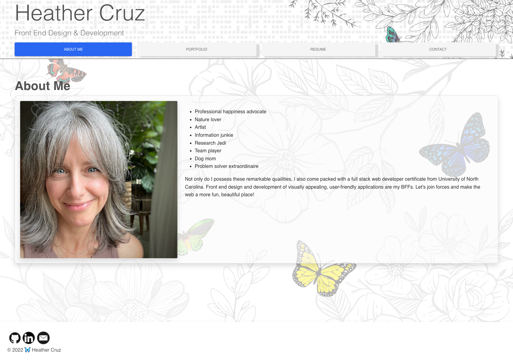
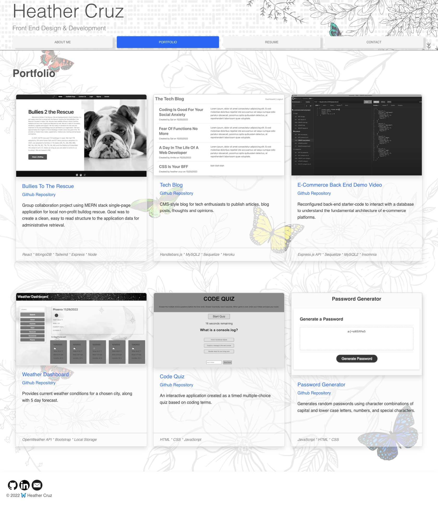
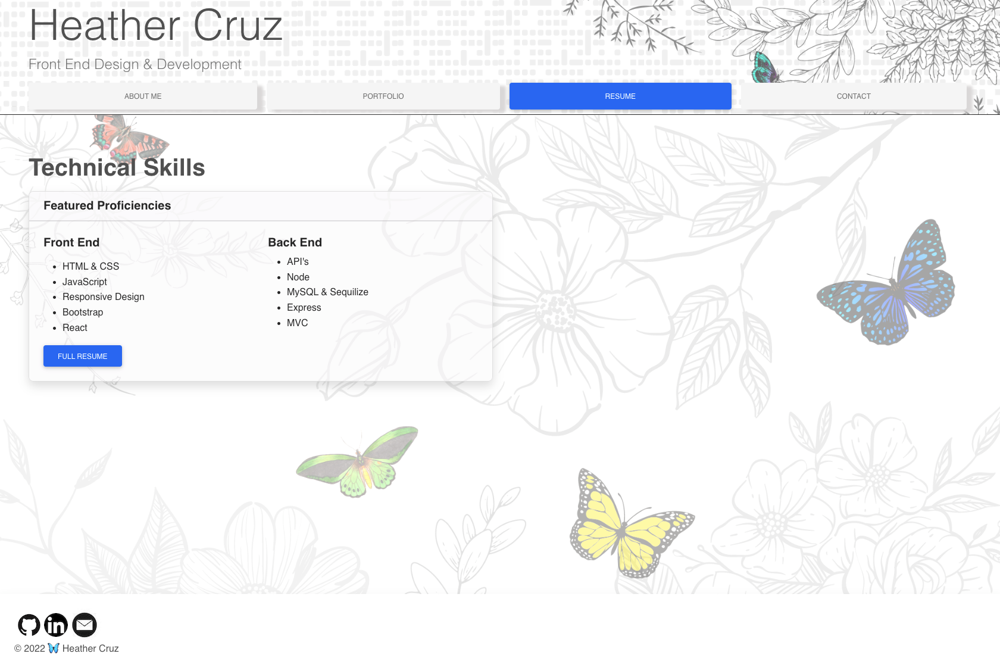
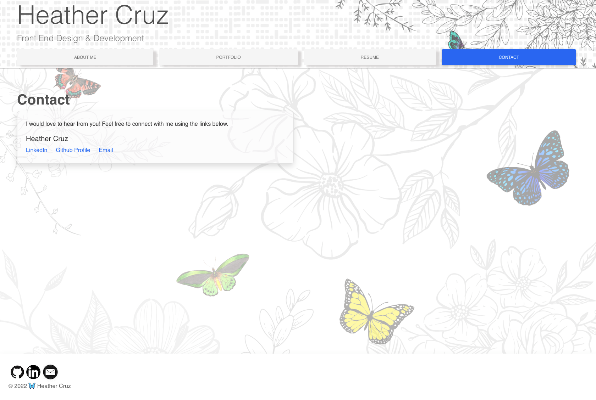

# React Portfolio

## Table of Content
* [Description](#description)
* [Technology](#technology)
* [Links](#links)
* [Visuals](#visuals)
* [Support](#support)

## Description
This is my official professional portfolio. There is a header component that appears on multiple pages, a navigation component that is used to conditionally render the different pages of the portfolio, a footer that appears on multiple pages, and a project component that is used to render the images and links to the deployed applications on Github.

## Technology
Along with React, HTML, CSS, and Bootstrap components were used to build the format of the front end. The application was deployed for the first time on Github pages. 

## Links

 [Github Link](https://github.com/hcruz77/portfolio)

 [Live link](https://hcruz77.github.io/portfolio/)

## Visuals

## Support
For questions or contribution requests:

HeatherCruz@gmail.com

 
https://github.com/hcruz77

