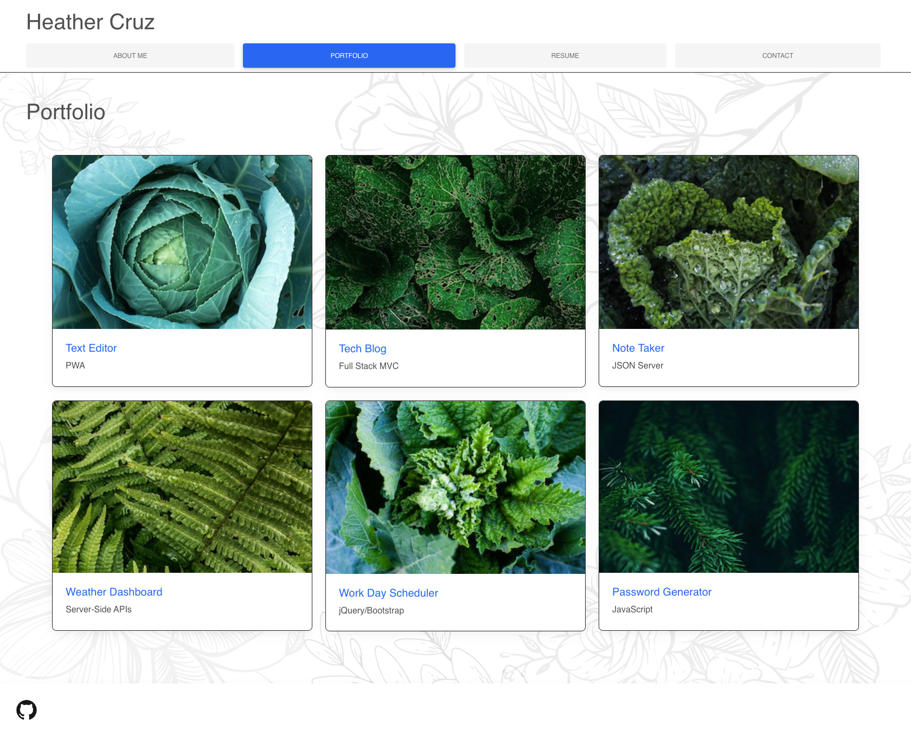
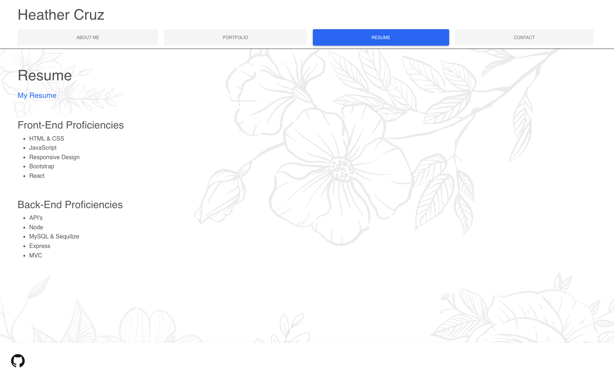
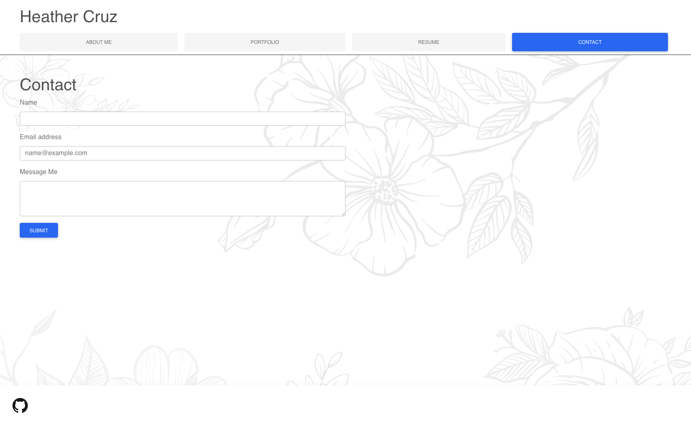

# React Portfolio

## Table of Content
* [Description](#description)
* [Technology](#technology)
* [Links](#links)
* [Visuals](#visuals)
* [Support](#support)

## Description
I created this sample portfolio to practice my skills using React. There is a header component that appears on multiple pages, a navigation component that is used to conditionally render the different pages of the portfolio, a footer that appears on multiple pages, and a project component that is used to render the images and links to the deployed applications on Github.

## Technology
Along with React, Bootstrap components were used to build the format of the frontend. The application was deployed for the first time on Github pages. Backend functionality will be added within the next few weeks and design tweeks. Until this happens the contact page does not save information. 

## Links

 [Github Link](https://github.com/hcruz77/portfolio)

 [Live link]()

## Visuals

## Support
For questions or contribution requests:

HeatherCruz@gmail.com
 
https://github.com/hcruz77

